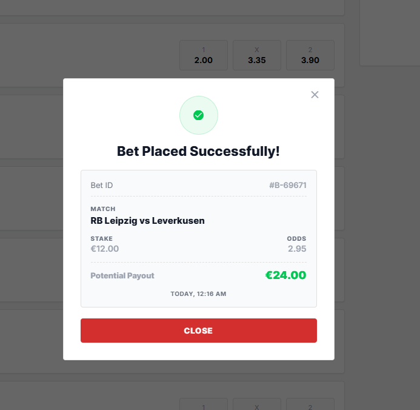
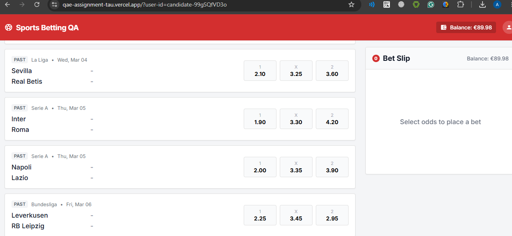
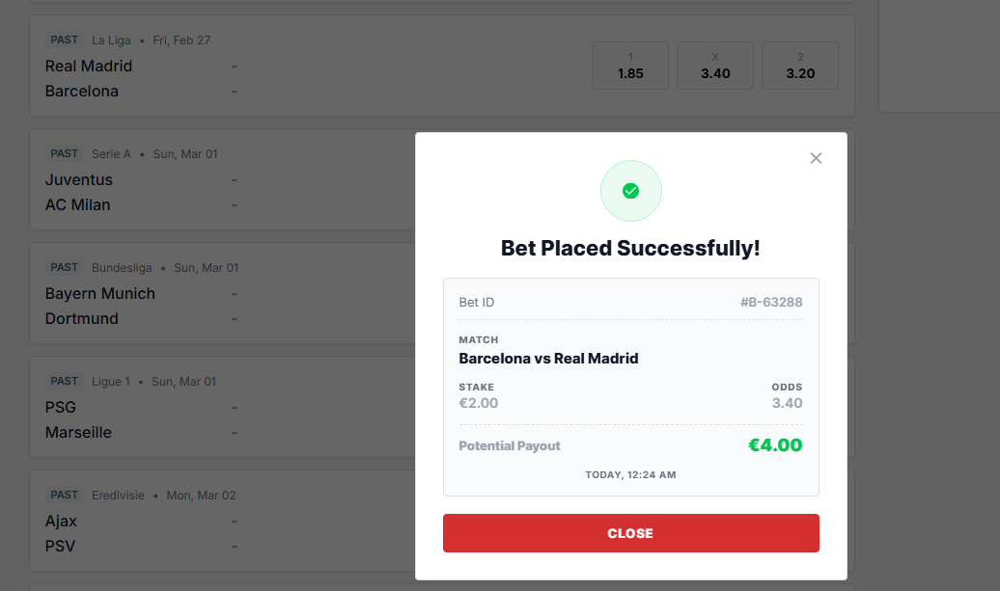
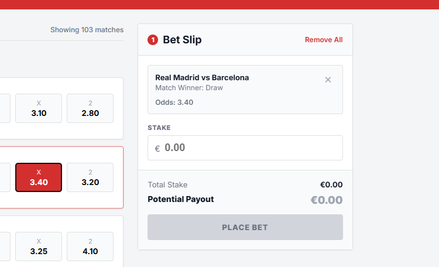
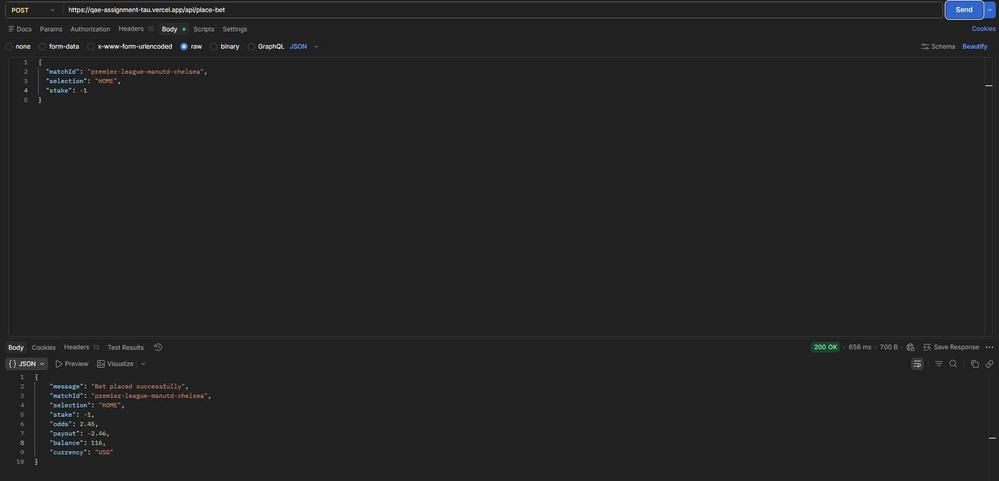
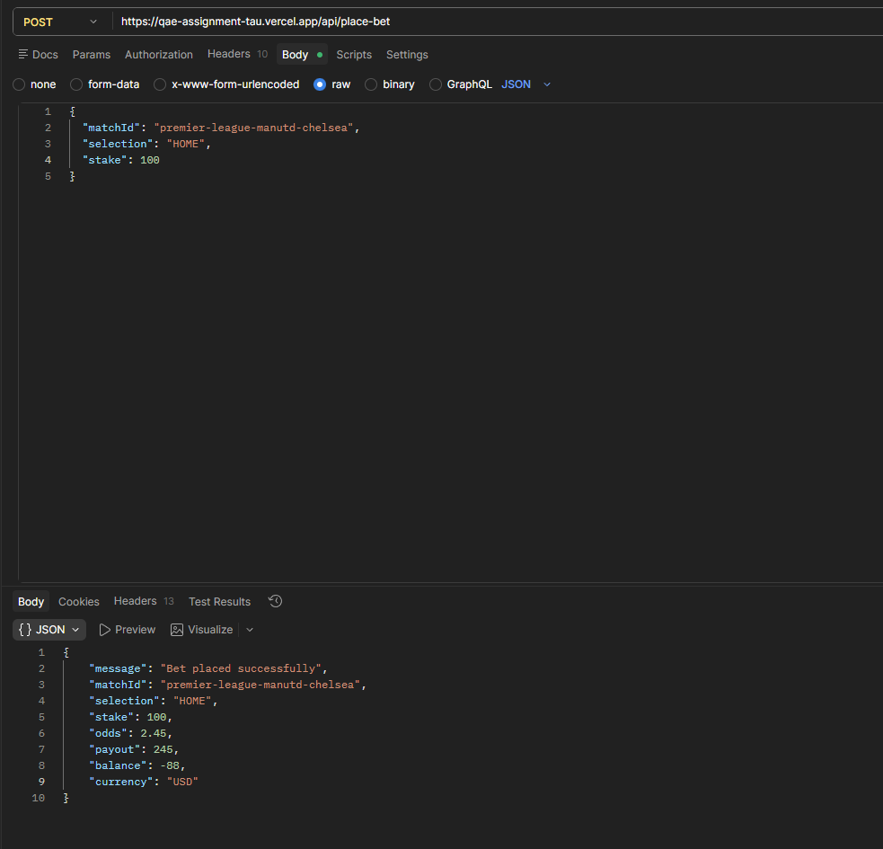
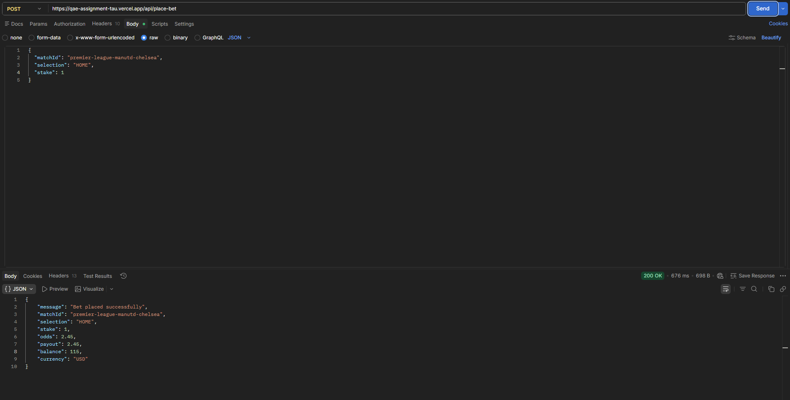

Bug Report — Single Bet Placement
---
UI Bugs
---

### BUG-UI-001 — Potential payout in success modal is always 2x the bet amount

**Severity**: Critical

**Reproduction Steps**:
1. Go to https://qae-assignment-tau.vercel.app/?user-id=candidate-99gSQfVD3o
2. Select a match and an odd
3. Add valid balance and click place bet
4. Observe that in the Successfull modal, the Potential Payout is always displayed as 2x Stake

**Expected vs Actual Result**:

- Expected: Potential payout should be calculated using the selected stake multiplied by the selected odds.  
- Actual: The success modal always shows the potential payout as 2x the bet amount, regardless of the selected odds.

**Business Impact**: The user receives incorrect financial information after placing a bet, which can damage trust and create payout disputes.

**Evidence**:

### BUG-UI-002 — Past matches are displayed in search results

**Severity**: High

**Reproduction Steps**:
1. Go to https://qae-assignment-tau.vercel.app/?user-id=candidate-99gSQfVD3o
2. Observe that under Upcoming Football Matches the "Past" matches are still displayed

**Expected vs Actual Result**:

* Expected: Search results should display only upcoming/pre-match football matches.  
* Actual: Past matches are still displayed in the search results.

**Business Impact**: Users may be confused by unavailable/expired events, and this increases the risk of invalid betting flows if past matches can also be selected.

**Evidence**:

### BUG-UI-003 — Balance is not refreshed in real time after placing a bet

**Severity**: High

**Reproduction Steps**:
1. Go to https://qae-assignment-tau.vercel.app/?user-id=candidate-99gSQfVD3o
2. Select a match and an odd
3. Add valid balance and click place bet
4. Observe that after successfully placing a bet, the balance is not updated until you refresh the page

**Expected vs Actual Result**:

- Expected: The displayed balance should update immediately after a successful bet placement.  
- Actual: The balance is updated only after refreshing the page.

**Business Impact**: Users may see an incorrect available balance and may believe they still have more funds than they actually do.

**Evidence**:

[BUG-UI-003.mp4](Screenshots/BUG-UI-003.mp4)

### BUG-UI-004 — Teams are swapped in the success modal

**Severity**: High

**Reproduction Steps**:
1. Go to https://qae-assignment-tau.vercel.app/?user-id=candidate-99gSQfVD3o
2. Select a match and an odd
3. Add valid balance and click place bet
4. Observe that in the Sucessfull modal the teams are swapped

**Expected vs Actual Result**:
* Expected: The success modal should display the same home and away team order as the selected match.  
* Actual: The teams are swapped in the success modal, making the away team appear as the home team.

**Business Impact**: The user may think they placed a bet on the wrong match or wrong team, creating confusion and potential trust issues.

**Evidence**: 

### BUG-UI-005 — No visual feedback or history page for placed bets

**Severity**: Medium

**Reproduction Steps**:
1. Go to https://qae-assignment-tau.vercel.app/?user-id=candidate-99gSQfVD3o
2. Select a match and an odd
3. Add valid balance and click place bet
4. Observe that after successfully placing a bet there is no visual feedback or some history page to show the user placed bets

**Expected vs Actual Result**:
* Expected: The application should provide clear feedback or a history/recent bets section so the user can confirm what bets were already placed.  
* Actual: There is no visible feedback or history page after placing a bet, making it difficult to confirm previous bets or verify state changes.

**Business Impact**: Users cannot easily review their placed bets, and QA cannot reliably confirm bet history/state behavior from the UI.

**Evidence**:

[BUG-UI-005.mp4](Screenshots/BUG-UI-005.mp4)

### BUG-UI-006 — Misleading `Remove All` text for a single-bet feature

**Severity**: Medium

**Reproduction Steps**:
1. Go to https://qae-assignment-tau.vercel.app/?user-id=candidate-99gSQfVD3o
2. Select a match and an odd
3. Observe that there is a misleading "Remove All" text for a single-bet feature

**Expected vs Actual Result**:
* Expected: Since the requirement supports only single bets, the UI action should use wording such as `Remove Selection`, `Clear Selection`, or `Remove Bet`.  
* Actual: The UI displays `Remove All`, which suggests that multiple bets/selections may be supported.

**Business Impact**: The wording is misleading and may confuse users or testers about whether the product supports single bets only or multi-bet behavior.

**Evidence**:

API Bugs
---
### Precondition for all api calls: Header `x-user-id = candidate-99gSQfVD3o`
### BUG-API-001 — User is able to place negative bets

**Severity**: Blocker

**Reproduction Steps**:
1. Open Postman or similar tool
2. Call https://qae-assignment-tau.vercel.app/api/place-bet with body->raw:`{
"matchId": "premier-league-manutd-chelsea",
"selection": "HOME",
"stake": -1
}`
3. Observe that Code is 200 and bet was successfully placed

**Expected vs Actual Result**:
* Expected: The API should reject negative stake values with a validation error.  
* Actual: The API allows the user to place a bet with a negative stake.

**Business Impact**: This is a financial integrity issue because negative bets can corrupt balance calculations and may allow balance manipulation.

**Evidence**:

### BUG-API-002 — User can place bets that exceed the current balance

**Severity**: Blocker

**Reproduction Steps**:
1. Open Postman or similar tool
2. Have Balance 0 or small number 
3. Call https://qae-assignment-tau.vercel.app/api/place-bet with body->raw:`{
"matchId": "premier-league-manutd-chelsea",
"selection": "HOME",
"stake": 1
}` and stake exeeding current balance
4. Observe that Code is 200 and bet was successfully placed

**Expected vs Actual Result**:
* Expected: The API should reject any bet where the stake is higher than the user’s available balance.  
* Actual: The API allows users to place bets that exceed their current balance.

**Business Impact**: Users can place unaffordable bets, which breaks a core financial validation rule and can cause incorrect account balances.

**Evidence**:

### BUG-API-003 — Balance reset gives 120 EUR instead of 125.50 EUR

**Severity**: Critical

**Reproduction Steps**:
1. Open Postman or similar tool 
2. Call https://qae-assignment-tau.vercel.app/api/reset-balance
3. Call https://qae-assignment-tau.vercel.app/api/balance
4. Observe that balance is 120 euros instead of 125.5 as stated in the reset-balance response

**Expected vs Actual Result**:
* Expected: Balance reset should return/reset the balance to 125.50 EUR, as stated in the response/requirement.  
* Actual: Balance reset gives 120 EUR instead of 125.50 EUR.

**Business Impact**: Incorrect reset balance creates inconsistent test data and impacts all balance-related validation.

**Evidence**:

[BUG-API-003.mp4](Screenshots/BUG-API-003.mp4)

### BUG-API-004 — API response currency is USD instead of EUR

**Severity**: Critical

**Reproduction Steps**:
1. Open Postman or similar tool
2. Call https://qae-assignment-tau.vercel.app/api/place-bet with body->raw:`{
"matchId": "premier-league-manutd-chelsea",
"selection": "HOME",
"stake": 1
}` 
3. Observe that `"currency": "USD"` is given in USD

**Expected vs Actual Result**:
* Expected: The API response should use EUR as the currency.  
* Actual: The API response states USD instead of EUR.

**Business Impact**: Currency mismatch creates serious financial and data-contract inconsistencies between the API, UI, and requirements.

**Evidence**:

### BUG-API-005 — API returns 200 during stress test but not all bets are processed

**Severity**: Critical

**Reproduction Steps**:
1. Open Postman or similar tool
2. Go to Run Collection->Performance and leave it as default
3. Select only https://qae-assignment-tau.vercel.app/api/place-bet with body->raw:`{
"matchId": "premier-league-manutd-chelsea",
"selection": "HOME",
"stake": 1
}`
4. Run this for few seconds
5. After this finishes call https://qae-assignment-tau.vercel.app/api/balance
6. Observe that Balance is not correctly deducted

**Expected vs Actual Result**:
* Expected: If the API returns HTTP 200, each request should be successfully processed. If the system cannot process all requests, it should return an appropriate error code.  
* Actual: During a stress test, the API returns HTTP 200, but not all bets are processed.

**Business Impact**: The system gives false success responses, which can cause data loss, unreliable bet placement, and incorrect user/account state under load.

**Evidence**:

[BUG-API-005.mp4](Screenshots/BUG-API-005.mp4)

UI + API Bugs
---

### BUG-BOTH-001 — User is able to place bets on past matches

**Severity**: Blocker

**Reproduction Steps**:

**For UI:**
1. Go to https://qae-assignment-tau.vercel.app/?user-id=candidate-99gSQfVD3o
2. Select a past match and an odd
3. Add valid balance and click place bet
4. Observe that after successfully placing a bet

**For API:**
1. Open Postman or similar tool 
2. Call https://qae-assignment-tau.vercel.app/api/place-bet with body->raw:`{
"matchId": "premier-league-manutd-chelsea",
"selection": "HOME",
"stake": 1
}`, make sure that matchID is from a past match 
3. Observe that the bet is successfully placed

**Expected vs Actual Result**:
* Expected: Past matches should not be available for betting in the UI, and the API should reject bet placement for past match IDs.  
* Actual: The user is able to place bets on past matches.

**Business Impact**: This breaks the core business rule that only upcoming/pre-match events can be used for betting and creates invalid betting transactions.

**Evidence**:

[BUG-BOTH-001.mp4](Screenshots/BUG-BOTH-001.mp4)